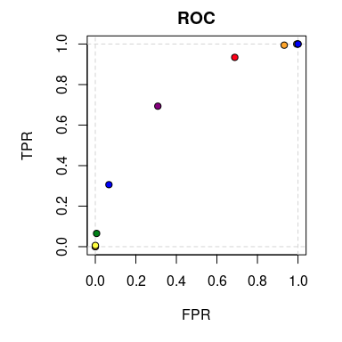
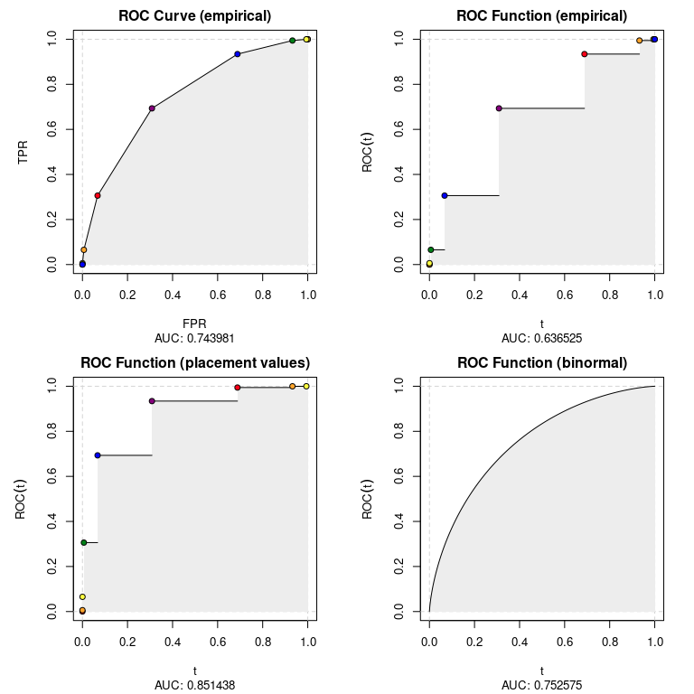

# ROCket 

[](https://cran.r-project.org/package=ROCket)
[](https://www.gnu.org/licenses/gpl-3.0.en.html)

## Intro

ROCket was primarily build for ROC curve estimation in the presence of
aggregated data. Nevertheless, it can also handle raw samples. In
general, aggregating data can be very beneficial when dealing with large
datasets. Whenever a dataset consists of categorical or discretized
continuous features, the data size can be effectively reduced by
calculating sufficient statistics for each constellation of feature
values. This saves memory and reduces the time needed to train
classification models. Also model accuracy assessment can be done on
aggregated data, which yields similar benefits. To this end, ROCket
provides functions for ROC curve estimation and AUC calculation.

## Installation

``` r
# From CRAN
install.packages("ROCket")

# From GitHub
# install.packages("devtools")
devtools::install_github("da-zar/ROCket")
```

## Example

### Data preparation

The easiest way to get started is to prepare a dataset containing all
distinct predicted score values together with their count and the number
of positive cases. Your dataset could look like this:

``` r
nrow(data_agg)
#> [1] 11
head(data_agg)
#>    score totals positives
#> 1:     1  62840     38499
#> 2:     0  62309     23985
#> 3:     2  30143     24092
#> 4:    -1  30282      6072
#> 5:    -2   6509       597
#> 6:     3   6642      6082
```

You can now pass this data to the `rkt_prep` function in order to create
an object that will be later used for estimating ROC curves (possibly
with several different algorithms).

``` r
prep_data_agg <- rkt_prep(
  scores = data_agg$score, 
  positives = data_agg$positives, 
  totals = data_agg$totals
)
```

It is not necessary to use an aggregated dataset. It’s also possible to
have each single observation in a separate row – in this case the
`positives` argument is the regular indicator (a numeric vector is
required) for positive observations and the `totals` argument is not
needed anymore (default is 1).

You can print the object, to get some information about the content, or
plot it:

``` r
prep_data_agg
#> .:: ROCket Prep Object 
#> Positives (pos_n): 100000 
#> Negatives (neg_n): 100000 
#> Pos ECDF (pos_ecdf): rkt_ecdf function 
#> Neg ECDF (neg_ecdf): rkt_ecdf function
plot(prep_data_agg)
```

<!-- -->

### ROC curves

Estimates of the ROC curve can be calculated with the `rkt_roc`
function. It takes two arguments. The first one is the `rkt_prep`
object, which contains all the needed data, and the second one is an
integer saying which method of estimation should be used. A list of
implemented methods can be retrieved with the `show_methods` function.

``` r
show_methods()
#>    nr                            desc
#> 1:  1           ROC Curve (empirical)
#> 2:  2        ROC Function (empirical)
#> 3:  3 ROC Function (placement values)
#> 4:  4         ROC Function (binormal)
```

In ROCket, we distinguish two types of ROC curve representations:

1.  parametric curves – TPR and FPR are functions of a parameter (the
    score),
2.  functions – TPR is a function of FPR.

In the first case we estimate two functions, the x and y coordinates of
the ROC curve (FPR, TPR). These two functions are returned as a list. In
the second case the output is a regular function.

Let’s now calculate estimates of the ROC curve using all available
methods.

``` r
roc_list <- list()
for (i in 1:4){
  roc_list[[i]] <- rkt_roc(prep_data_agg, method = i)
}
```

The output of `rkt_roc` can be used to plot the ROC curve estimates and
calculate the AUC.

``` r
par(mfrow = c(2, 2))
for (i in 1:4){
  plot(
    roc_list[[i]], 
    main = show_methods()[i, desc], 
    sub = sprintf('AUC: %f', auc(roc_list[[i]]))
  )
}
```

<!-- -->
